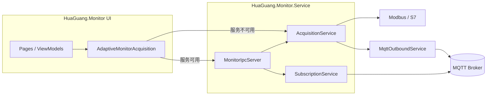

# 工业监控 — 代码架构与运行逻辑

> 面向开发者的实现说明。产品界面与字段说明见 [DESIGN.md](DESIGN.md)。

---

## 1. 解决方案总览

| 项目 | 类型 | 职责 |
|------|------|------|
| `HuaGuang.Monitor.Core` | 类库 | 领域模型、产线 Excel、协议地址解析、MQTT 报文映射、历史 SQLite、自检用例 |
| `HuaGuang.Monitor.Runtime` | 类库 | PLC/MQTT 运行时、采集与订阅服务、日志、Windows IPC |
| `HuaGuang.Monitor` | .NET MAUI | WinUI / Android UI、ViewModel、平台适配 |
| `HuaGuang.Monitor.Service` | Windows 服务 | 后台常驻采集/订阅 + IPC（工控机推荐部署方式） |
| `HuaGuang.Monitor.Tests` | xUnit | 聚合 `MonitorCoreTests` 等 |
| `tools/*` | 控制台 | Excel 维护、MQTT 探测、IPC 冒烟测试 |

依赖方向（只允许向内）：

```
MAUI / Service  →  Runtime  →  Core
```

Core **不引用** Runtime 或 MAUI，保证 Excel/映射/单测可在无 UI 环境运行。

---

## 2. 进程与部署模型

### 2.1 Windows 工控机（典型）



- UI 进程：`AddMonitorRuntimeAdaptive()` → `IMonitorAcquisition` 在 **IPC 可用** 时走 `RemoteMonitorAcquisition`，否则本进程内 `AcquisitionService`。
- 服务进程：注册完整 `AddMonitorRuntimeCore()` + 命名管道/TCP IPC + `MonitorConfigWatcher`（监听产线 Excel 变更）+ `MonitorAutoStartWorker`。
- 两套进程共享 **同一份** `ProgramData\com.industrial.monitor\Data`（或回退到 LocalAppData，见 `WindowsSharedDataDirectory`）。

### 2.2 Android 平板

- 仅 MAUI 单进程：`AddMonitorRuntimeLocal()`，无 Windows 服务。
- 产线 Excel 来自 `MauiBundledLineFileProvider` 拷贝到应用可写目录。
- 日志与数据在 `FileSystem.AppDataDirectory`。

---

## 3. 配置与状态：单一事实来源

### 3.1 内存模型 `AppSettings`

运行时一切行为由 `AppSettings` 驱动（`HuaGuang.Monitor.Core/Models/AppSettings.cs`）：

| 区块 | 含义 |
|------|------|
| `LineName` / `DeviceId` | 当前产线、MQTT `{deviceId}` 替换 |
| `OperationMode` | `Acquisition` 采集 / `Subscribe` 订阅 |
| `ScanIntervalMs` / `PublishIntervalMs` | PLC 扫描周期 vs MQTT **发布节流**（独立） |
| `Plc` | Modbus TCP 或 S7（协议、IP、机架槽位、CPU 类型） |
| `MqttEndpoints` | **多 MQTT 发布目标**（Broker、账号、主题各一套） |
| `Mqtt` | 首个启用目标的镜像 + 订阅模式单连接 + 「配置」页兼容字段 |
| `Tags` | 点表（PLC 地址、类型、MQTT 字段、显示分组） |
| `MqttPayload` | properties 报文模板（字段映射、格式） |

`SettingsStore`（Runtime）持有 `Current`，`Revision` 在 Load/Save 后递增；UI 可据此刷新监控卡片。

### 3.2 持久化：产线 Excel 为主

**权威配置**是每条产线一个 xlsx，路径：

`{LinesDirectory}/{产线名}.xlsx`

- `LinesDirectory`：默认 `AppPaths.UserDataDirectory\lines`（Windows 多为 ProgramData 下；安装目录 `lines` 为模板只读副本，见 `LineConfigPaths`）。
- `当前产线.txt` 记录活动产线名。

`LineExcelConfigService` 负责 **Apply（读）** 与 **Export（写）**：

| 工作表 | 内容 |
|--------|------|
| 配置 | 产线名、扫描/发布周期、PLC、MQTT 摘要、运行模式等键值 |
| MQTT目标 | 多行：每目标 Broker、ClientId、用户名、密码、主题、ID |
| MQTT报文 | `MqttPayloadProfile`（properties 格式等） |
| 字段映射 | 点位名 → 平台字段名 |
| 点表 | 启用、地址、类型、单位、字节序、手动值、显示分组 |
| 点表·显示分组 | 分组说明（只读参考） |

加载顺序（`ApplyWorkbook`）：配置 → MQTT目标 → `MqttEndpointCatalog.Normalize` → MQTT报文 → 点表 → 字段映射补全。

保存设置（UI）：`SettingsViewModel` 合并界面 → `SettingsStore.SaveAsync` → `LineConfigPaths.SaveLine` → **整表 Export**（重写 xlsx）。

### 3.3 MQTT 多目标规范化

`MqttEndpointCatalog`：

- `Normalize`：空列表时从 `Mqtt` 补一条；补全 Id/Name；**重复 Id 自动拆成新 Guid**；`GetPrimary` 同步到 `settings.Mqtt`。
- `GetEnabledPublishEndpoints`：采集发布时使用。
- `ValidatePublishCredentials`：连接前校验用户名/密码非空。

---

## 4. 分层职责详解

### 4.1 Core — 协议与地址

| 组件 | 作用 |
|------|------|
| `XinjeXd5eMapper` | 信捷 D/M/X/Y → Modbus 表与地址 |
| `SiemensS7AddressMapper` | DB/I/Q/M、IW/ID、%IW、EW→IW 等 |
| `PlcAddressMapper` | 按 `PlcProtocol` 统一 TryResolve / ApplyTo |
| `RegisterConverter` / `S7ByteConverter` | 寄存器/字节 →  CLR 值 |
| `ModbusTagBatchReader`（Runtime 调用） | 批量读优化 |

点表字段 `PlcTag.XinjeAddress` 为**通用地址列名**（历史命名）；S7 下存 `IW64` 等。

### 4.2 Core — MQTT 与展示

| 组件 | 作用 |
|------|------|
| `MqttPayloadMapper` | 按 `MqttPayloadProfile` 把点位值组装为 JSON |
| `MqttFieldMappingCatalog` | 默认字段名、properties 模板 |
| `ValueFormatting` / `TagDisplayOrder` | 显示精度、分组排序 |
| `SubscribeTopicHelper` / `MqttTopicDeviceId` | 订阅主题与 deviceId 解析 |

### 4.3 Runtime — PLC 客户端

`PlcClientRouter` 实现 `IPlcClient`，按 `settings.Plc.Protocol` 委托：

- `ModbusTcpPlcClient`：NModbus；读失败/超时 `AbortOnTimeout` 会 **强制关 socket**。
- `S7PlcClient`：S7.Net；`ReadBytes` + `S7ByteConverter`。

**连接策略（采集）**：`AcquisitionService.TryEnsurePlcAsync` 按需连接；**任一批量读失败**会 `DisconnectAsync` 并 **5 秒退避**再连（表现为「连上就断」时需查读点异常）。

### 4.4 Runtime — MQTT 出站

```mermaid
sequenceDiagram
  participant Loop as AcquisitionLoop
  participant Out as MqttOutboundService
  participant Pub as MqttPublisher per EndpointId
  participant Br as Broker

  Loop->>Loop: ShouldPublish?
  Loop->>Out: Enqueue(item x N targets)
  Out->>Out: Worker dequeue
  Out->>Out: EnsureConnected(endpoint)
  Out->>Pub: ConnectAsync(ToSettings)
  Pub->>Br: MQTT CONNECT
  Out->>Pub: PublishAsync(topic, payload)
```

- `MqttOutboundService`：**独立后台线程** + 队列；采集线程只入队，不阻塞 PLC。
- 每个 `MqttEndpoint.Id` 对应一个 `MqttPublisher` 实例；凭证变化会重连（`MatchesConnection`）。
- `AllEnabledTargetsConnected`：全部启用目标在线才视为 MQTT 全绿（诊断页逐条展示 `MqttTargetsStatus`）。

`SubscriptionService` **不使用** `MqttOutboundService`；单连接 + 多主题订阅，读 `settings.Mqtt`（单套 Broker）。

### 4.5 Runtime — 采集主循环

`AcquisitionService` 在 **专用线程** `AcquisitionLoop` 中：

1. `LoadAsyncIfChanged`（启动时）并重置 MQTT 连接。
2. 每周期：`RunCycleAsync`
   - 模拟器：断开 PLC，生成模拟值。
   - 否则：`TryEnsurePlcAsync` → `ReadTagsAsync`（失败则断开 PLC）。
   - 合并手动点位 → `TagSnapshot` → `TagsUpdated`（UI + `HistoryRecorder`）。
   - `ShouldPublish`：强制发布信号 / **发布周期** / 温度变化阈值。
   - 对每个启用 MQTT 目标 **分别入队** 相同 payload。
3. 周期节拍：`AcquisitionTiming.ResolveScanIntervalMs`；等待时间 = 扫描周期 − 本周期耗时。

发布周期与扫描周期 **解耦**：Excel「发布周期毫秒」缺省为 60000，不再回退为扫描周期。

### 4.6 Runtime — 历史

`HistoryRecorder`：订阅 `TagsUpdated` / 订阅遥测事件 → **Channel 异步写** SQLite（`HistoryStore`），避免阻塞采集。

### 4.7 Runtime — IPC

| 命令 | 作用 |
|------|------|
| `GetStatus` | 运行状态、PLC/MQTT、快照、各 MQTT 目标摘要 |
| `Start` / `Stop` | 启停采集或订阅 |
| `ReloadSettings` | 重新 Load Excel |
| `RequestPublish` | 下一周期强制发布 |

传输：命名管道 `HuaGuang.Monitor.Runtime.v1` + 本地 TCP `18788` 备用。

### 4.8 MAUI — UI 与 MVVM

| ViewModel | 页面 | 要点 |
|-----------|------|------|
| `DashboardViewModel` | 监控 | 绑 `IMonitorAcquisition` / `IMonitorSubscription`；启停、卡片网格 |
| `SettingsViewModel` | 设置 | 产线切换、Excel 导入导出、**MqttEndpoints 列表**、保存 → `SettingsStore` |
| `TagsViewModel` / `TagEditViewModel` | 点位 | 地址解析提示 `PlcAddressMapper` |
| `HistoryViewModel` | 历史 | 分页查 `HistoryStore` |
| `DiagnosticsViewModel` | 诊断 | 运行日志缓冲、**运行时 Excel 路径**、MQTT 目标凭证摘要、自检 |

设置页 MQTT 变更会通过 `SyncMqttEndpointsToStore` 写入 `SettingsStore.Current`，避免未点「保存」时被其它写 Excel 操作覆盖（仍建议保存设置落盘）。

平台注入：`IStartupRegistration`、`IScannerInputMethodGuard`、`IBackgroundRuntimeLauncher`（Windows 服务安装/交接）。

---

## 5. 关键业务逻辑

### 5.1 产线切换

`SettingsViewModel` 选产线 → `LineExcelConfigService.SwitchLine`（必要时从安装包模板复制）→ `SaveAsync` 写回 → `LoadFrom` 刷新 UI → IPC `ReloadSettings`（若服务在跑）。

### 5.2 采集模式数据流

```
PLC 读数 → TagSnapshot → 界面刷新
                    ↘ HistoryRecorder → SQLite
                    ↘ ShouldPublish → MqttPayloadMapper → N 个 MQTT 目标
```

### 5.3 订阅模式数据流

```
Broker → SubscriptionService 解析 JSON → RemoteDeviceState 缓存
      → Dashboard 按主题筛选 → HistoryRecorder（若开启）
```

### 5.4 日志

| 位置 | 文件前缀 |
|------|----------|
| UI 进程 | `runtime-ui-yyyyMMdd.log` |
| Windows 服务 | `runtime-yyyyMMdd.log` |
| 崩溃/退出 | `crash-*` / `exit-*` / `bootstrap-*` |

目录：`AppPaths.LogDirectory`（见诊断页「日志与数据路径」）。`RuntimeLogStore` 供诊断页内存 tail；文件日志经 `FileLoggerExtensions`。

---

## 6. 目录结构（源码）

```
huaGuang/
├── config/lines/              # 仓库内产线 Excel 模板（发布到安装包 lines/）
├── docs/
│   ├── DESIGN.md              # 产品/UI 设计手册
│   └── ARCHITECTURE.md        # 本文档
├── src/
│   ├── HuaGuang.Monitor.Core/
│   │   ├── Models/            # AppSettings, PlcTag, MqttEndpoint, …
│   │   ├── Protocols/         # 地址映射、寄存器转换
│   │   ├── Services/          # Excel、Catalog、Mapper、HistoryStore
│   │   └── Diagnostics/       # MonitorCoreTests
│   ├── HuaGuang.Monitor.Runtime/
│   │   ├── Protocols/         # ModbusTcpPlcClient, S7PlcClient, PlcClientRouter
│   │   ├── Messaging/         # MqttOutboundService, MqttPublisher, …
│   │   ├── Services/          # Acquisition, Subscription, SettingsStore, …
│   │   ├── Hosting/           # DI 扩展、ConfigWatcher、AutoStart
│   │   └── Ipc/               # 服务与 UI 通信
│   ├── HuaGuang.Monitor/
│   │   ├── ViewModels/ Views/ Controls/
│   │   ├── Platforms/         # Windows / Android 特定实现
│   │   └── MauiProgram.cs     # 组合根
│   └── HuaGuang.Monitor.Service/
│       └── Program.cs         # Windows 服务入口
├── test/HuaGuang.Monitor.Tests/
└── tools/                     # GenerateLineExcel, SyncPlanningExcel, …
```

---

## 7. 扩展与维护指引

| 需求 | 建议改动位置 |
|------|----------------|
| 新产线默认点表 | `LineCatalog` + `config/lines/{名}.xlsx` |
| 新 PLC 协议 | 新 `IPlcClient` + `PlcClientRouter` + `PlcAddressMapper` 分支 |
| 新 MQTT 报文格式 | `MqttPayloadProfile` + `MqttPayloadMapper` |
| Excel 新列/表 | `LineExcelConfigService` Apply/Export 对称修改 + `MonitorCoreTests` |
| 诊断/自检 | `MonitorCoreTests.RunAll()` + `DiagnosticsViewModel` |

单测入口：诊断页「核心测试」，或 `dotnet test` 聚合 `MonitorCoreTestsTests.CoreTests_AllPass`。

---

## 8. 与 DESIGN.md 的分工

- **DESIGN.md**：产品定位、界面与字段、部署与产线说明（面向现场与产品）。  
- **ARCHITECTURE.md**（本文）：进程、模块、配置加载顺序、采集/MQTT/IPC 实现细节（面向开发）。  

二者均以 **产线 Excel + SettingsStore** 为运行时配置来源；Save 时 Export 整表。若与代码不一致，以代码为准并同步修订文档。

---

*文档随代码演进更新；重大架构变更请同步修订本节与 DESIGN 概述。*
