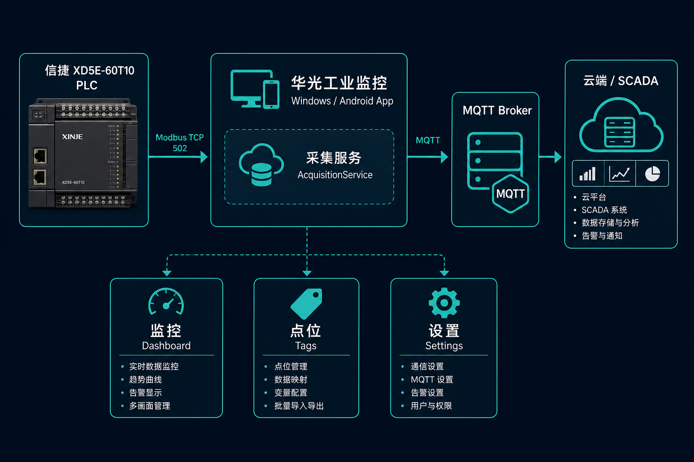
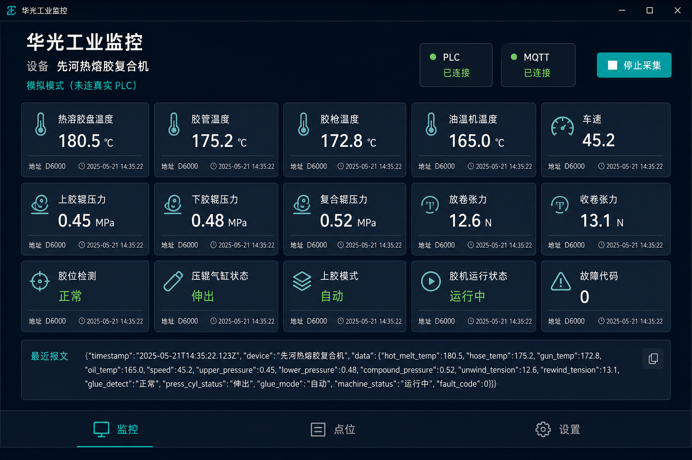
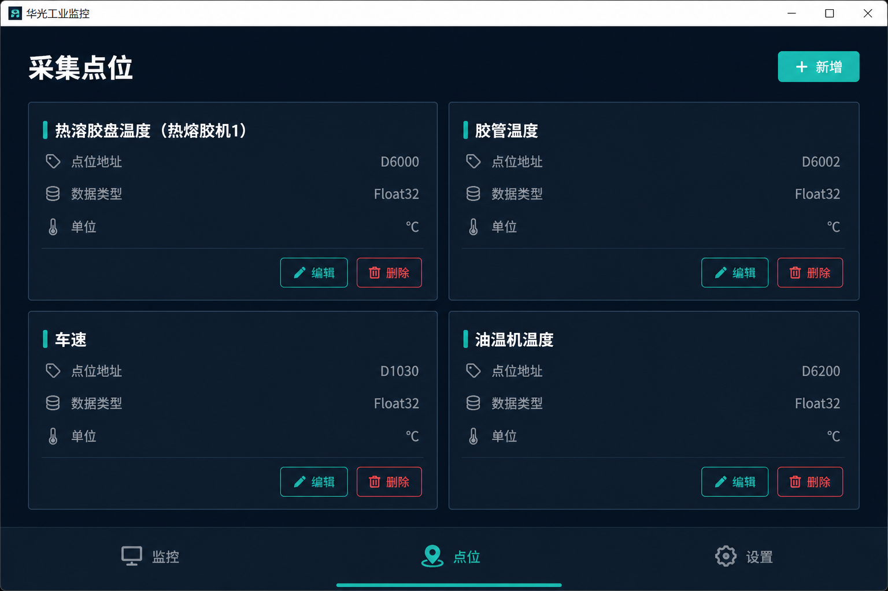
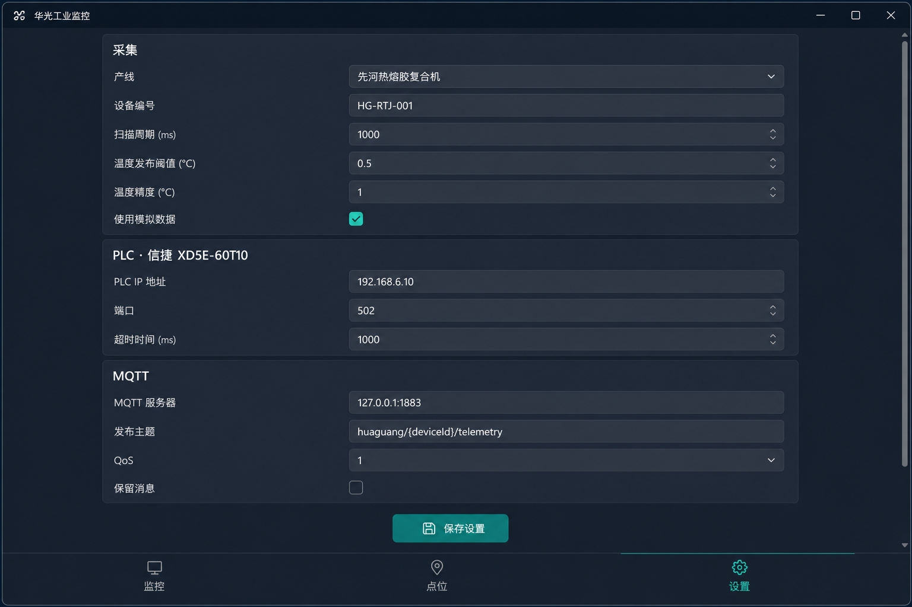

# 工业监控 — 设计手册

> 版本 1.1 · 平台：Windows 10/11 工控机、Android 11 工业平板  
> 技术栈：.NET 10 MAUI · 信捷 XD5E-60T10 · Modbus TCP · MQTT  
> PDF 版：[DESIGN.pdf](DESIGN.pdf)（运行 `python ../scripts/export-design-pdf.py` 重新生成）

---

## 1. 产品概述

**工业监控** 是一套面向热熔胶复合产线的现场采集终端。支持两种运行方式：

- **采集模式**：按设定周期从信捷 PLC 读取机台点位，经阈值与精度处理后，以 JSON 通过 MQTT 上报。
- **订阅模式**：连接同一 MQTT Broker，订阅一个或多个主题，在局域网内查看其他采集终端的遥测数据。

| 项目 | 说明 |
|------|------|
| 应用名称 | 工业监控 |
| 包名 / ID | `com.industrial.monitor` |
| 默认产线 | 先河热熔胶复合机（`192.168.6.10`） |
| 可选产线 | 华迪热熔胶复合机（`192.168.6.20`） |
| PLC 型号 | 信捷 XD5E-60T10，Modbus TCP 502 |

---

## 2. 系统架构



```
┌─────────────┐    Modbus TCP     ┌──────────────────┐    MQTT JSON    ┌─────────────┐
│  XD5E-60T10 │ ────────────────► │  工业监控 App  │ ──────────────► │ MQTT Broker │
│  PLC :502   │    周期轮询        │  (Win / Android)  │   按阈值发布     │  / 云端     │
└─────────────┘                   └──────────────────┘                 └─────────────┘
                                         │
                    ┌────────────────────┼────────────────────┐
                    ▼                    ▼                    ▼
              DashboardPage          TagsPage           SettingsPage
              实时监控               点位管理              参数配置
```

### 2.1 核心模块

| 模块 | 职责 |
|------|------|
| `AcquisitionService` | 采集模式：轮询 PLC、模拟数据、阈值判断、MQTT 发布 |
| `SubscriptionService` | 订阅模式：连接 Broker、多主题订阅、解析遥测 JSON |
| `SubscribeTopicHelper` / `MqttTopicMatcher` | 主题列表规范化、MQTT 通配符匹配 |
| `ModbusTcpPlcClient` | 信捷地址映射与 Modbus 读寄存器 |
| `MqttPublisher` / `MqttConnectionFactory` | MQTT 连接与 JSON 报文发布 |
| `SettingsStore` | 本地 `settings.json` 持久化 |
| `LineCatalog` | 产线数据地址规划点表 |
| `WindowsStartupRegistration` | Windows 开机自启注册表项 |

### 2.2 数据流（采集模式）

1. 按 **扫描周期**（默认 1000 ms）读取所有启用点位  
2. 温度点位按 **精度** 四舍五入（全局默认或点位单独设置）  
3. 若 **温度发布阈值** > 0，仅当任一温度变化 ≥ 阈值时才发布；否则每次扫描都发布  
4. 监控页 **始终刷新** 显示，与是否发布 MQTT 无关  

### 2.3 数据流（订阅模式）

1. 连接 Broker，**同时订阅** 设置中配置的全部主题（支持 `+` / `#`）  
2. 收到 JSON 遥测后按 `主题::deviceId` 区分设备并缓存  
3. 首页 **主题筛选** 可选「全部」或某一主题，设备列表随之过滤  
4. 运行中可在首页 **添加主题**，保存后自动重连并增订，无需停止订阅  

---

## 3. 视觉设计规范（Windows）

### 3.1 设计语言

深色工业风，高对比度数值、低干扰背景，适配工控机长时间运行。

### 3.2 色彩

| 用途 | 色值 | 说明 |
|------|------|------|
| 页面背景 | `#0B1522` | 主背景 |
| 卡片背景 | `#152536` | 点位卡片、状态块 |
| 卡片边框 | `#1F3A52` | 1 px 描边 |
| Tab 栏背景 | `#101C28` | 底部导航 |
| 主强调色 | `#2EC4B6` | 数值、选中 Tab、按钮 |
| 主文字 | `#FFFFFF` | 标题 |
| 次级文字 | `#8AA0B5` | 标签、说明 |
| 数值辅助 | `#C9D6E2` | 报文、点名 |
| 成功 / 已连接 | `#3DDC97` | 状态点 |
| 警告 | `#FFB347` | 未发布提示 |
| 错误 | `#FF6B6B` | 异常信息 |
| 删除按钮 | `#5A2430` | 危险操作 |

### 3.3 字体与圆角

| 元素 | 规格 |
|------|------|
| 页面标题 | 20 pt，Bold，White |
| 区块标题 | 18 pt，Bold |
| 实时数值 | 22 pt，Bold，`#2EC4B6` |
| 卡片圆角 | 8 px |
| 状态点 | 7–8 px 圆形 |

### 3.4 导航结构

底部 **TabBar** 三页，**无顶部 Shell 标题栏**（`Shell.NavBarIsVisible=False`），内容区自带标题。

| Tab | 路由 | 功能 |
|-----|------|------|
| 监控 | `dashboard` | 实时数据、启停采集/订阅、连接状态、订阅主题筛选 |
| 点位 | `tags` | 点位列表、增删改、手动值、显示精度 |
| 设置 | `settings` | 运行模式、产线、PLC、MQTT、阈值与精度、开机自启 |

---

## 4. 界面设计（Windows）

### 4.1 监控页



**布局（上 → 下）**

| 区域 | 内容 |
|------|------|
| 顶栏 | 应用名、设备 ID、运行模式；PLC / MQTT 状态卡片（采集模式显示 PLC）；**启动采集 / 停止采集** 或 **启动订阅 / 停止订阅** |
| 订阅区 | （订阅模式）主题筛选 Picker、「全部」+ 各配置主题；添加主题输入框与按钮 |
| 设备选择 | （订阅模式且有数据）远程设备 Picker；「全部」视图下显示 `设备ID (主题)` |
| 信息条 | 发布/订阅主题摘要；橙色状态提示；红色错误信息 |
| 主区域 | 自适应网格卡片，展示各点位实时值、单位、地址/来源主题、质量、更新时间 |
| 底栏 | 最近 MQTT 报文摘要（单行截断） |

**状态指示**

- 绿点 +「已连接」：PLC / MQTT 正常  
- 灰点 +「未连接」：未连或模拟模式下未建立连接  

**交互**

- 「启动采集」：开始轮询并按规则发布 MQTT  
- 「停止采集」：断开 PLC / MQTT，停止轮询  
- 「启动订阅 / 停止订阅」：订阅模式下连接 Broker 并监听配置主题  
- 主题筛选切换不中断订阅；添加主题后若已在运行则自动刷新订阅列表  

---

### 4.2 点位页



**布局**

| 区域 | 内容 |
|------|------|
| 顶栏 | 标题「采集点位」+ **新增** 按钮 |
| 主区域 | 点位卡片网格：名称、信捷地址、数据类型、单位 |
| 卡片操作 | **编辑** / **删除**（删除为红色按钮） |

**点位编辑页**（从本页跳入）

- 信捷地址：`D100`、`M0`、`X20`（八进制）、`Y0`  
- 浮点占两个 D，默认字节序 **CDAB**  
- Scale / Offset 工程量换算  
- **显示精度**：0–4 位小数，留空则使用设置页全局精度  

> 产线切换时在「设置」页载入点表，会覆盖当前点位列表。

---

### 4.3 设置页



**分组字段**

#### 采集

| 字段 | 说明 |
|------|------|
| 运行模式 | **采集模式**（读 PLC 发 MQTT）或 **订阅模式**（看远程遥测） |
| 订阅主题 | 订阅模式下可配置 **多个** 主题，支持 `+` / `#`；至少保留一个 |
| 产线 | 先河 / 华迪，载入对应 IP 与点表（仅采集模式） |
| 设备编号 | MQTT `{deviceId}` 替换用（采集模式） |
| 扫描周期 | 200–60000 ms |
| 温度发布阈值 | `0` = 每次都发；`>0` = 任一温度变化达该 ℃ 才发 |
| 温度精度 | 0–4 位小数，全局默认；各点位可单独覆盖 |
| 使用模拟数据 | 无 PLC 时生成波形数据，可验证 MQTT |
| 开机自动启动 | Windows 登录后运行本程序（需平台支持） |
| 启动后自动运行 | 打开程序后自动开始采集或订阅 |

#### PLC（信捷 XD5E-60T10）

| 字段 | 默认 |
|------|------|
| IP | `192.168.6.10` / `192.168.6.20` |
| 端口 | 502 |
| 站号 | 1 |
| 超时 | 2000 ms |

#### MQTT

| 字段 | 默认 |
|------|------|
| Broker | `127.0.0.1:1883` |
| 主题 | `monitor/{deviceId}/telemetry` |
| QoS | 0 |

> **保存前须停止采集/订阅**（首页运行中添加主题除外，会即时重连）。

---

## 5. MQTT 报文格式

```json
{
  "deviceId": "先河热熔胶复合机",
  "timestamp": "2026-08-19T05:30:00Z",
  "simulator": false,
  "plcHost": "192.168.6.10",
  "quality": "Good",
  "tags": {
    "热溶胶盘温度（热熔胶机1）": 180.5,
    "胶管温度（热熔胶机1）": 175.2,
    "车速": 45.2
  }
}
```

| 字段 | 说明 |
|------|------|
| `quality` | `Good` 全部成功；`Uncertain` 部分点位失败 |
| `tags` | 键为点位名称，温度为精度处理后数值 |

---

## 6. 默认点表（节选）

来源：产线数据地址规划 — 仅「机台获取」REAL 点位。

| 名称 | 地址 | 单位 |
|------|------|------|
| 运行状态 | D1000 | 开/关（Bool，0/1 启动指示灯） |
| 热溶胶盘温度（热熔胶机1） | D6000 | ℃ |
| 胶管温度（热熔胶机1） | D6002 | ℃ |
| 油温机温度 | D6200 | ℃ |
| 车速 | D1030 | — |
| 卷曲张力 | D1090 | — |

**手动输入**（不读 PLC，在点位页编辑手动值后随 MQTT 发布）：

| 名称 | 类型 | 单位 |
|------|------|------|
| 胶辊型号 | 文本 | — |
| 胶水型号 | 文本 | — |
| 门幅 | 浮点 | mm |
| 厚度 | 浮点 | mm |

华迪产线无「上展开转速率」。

---

## 7. 部署与运行（Windows）

| 场景 | 方式 |
|------|------|
| 开发调试 | Visual Studio F5，`net10.0-windows10.0.19041.0` |
| 生成安装包 | VS **Release 发布**（自动）或 `build-installer.bat` → `installer/output/IndustrialMonitor-Setup.exe` |
| 现场工控机 | **双击安装包**，向导安装到 Program Files |
| 无 PLC 联调 | 勾选模拟数据 + 本地 Mosquitto（`start-test-mqtt.ps1`） |

**安装包（推荐）**

- 格式：Inno Setup 单文件 `IndustrialMonitor-Setup.exe`
- 现场：双击安装，可选桌面图标与开机启动，支持卸载
- 无需命令行、无需预装 .NET（Release 自包含）

**开机自动启动**

- 安装向导中可勾选「开机自动启动」
- 「设置 → 开机自动启动」可开关；保存后立即生效
- 「设置 → 启动后自动采集」：程序打开后自动点「启动采集」（默认开启）
- 默认开启；工控机重启并登录 Windows 后程序自动运行并开始采集

**运行环境**

- Windows 10 1809+ x64  
- Debug 需安装 [Windows App Runtime 1.7](https://aka.ms/windowsappsdk/1.7/latest/windowsappruntimeinstall-x64.exe)  
- Release 自包含，工控机无需预装 .NET  

---

## 8. 文件与目录

```
huaGuang/
├── installer/
│   ├── IndustrialMonitor.iss   ← Inno Setup 脚本
│   └── output/                 ← 生成的 IndustrialMonitor-Setup.exe
├── docs/
│   ├── DESIGN.md          ← 本设计手册
│   └── images/            ← 界面与架构图
├── src/HuaGuang.Monitor/  ← MAUI 主工程
├── scripts/               ← 编译、发布、测试脚本
└── test/                  ← MQTT 与示例配置
```

---

## 9. 修订记录

| 版本 | 日期 | 说明 |
|------|------|------|
| 1.1 | 2026-08-20 | 订阅模式与多主题切换、Windows Inno 安装包、开机自启、点位显示精度、默认手动标签 |
| 1.0 | 2026-08-19 | 初版：三 Tab 界面、温度阈值/精度、Windows 界面说明 |
